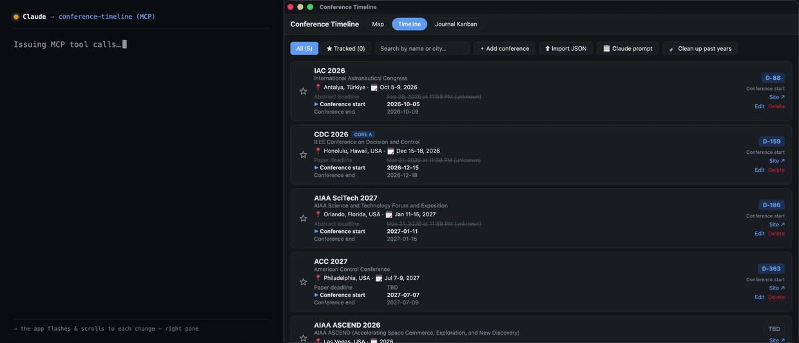

# Conference Timeline

[English](README.md) | **한국어**

연구자를 위한 학회 마감 추적 + 저널 투고 관리 데스크톱 앱입니다. MCP 서버가 내장되어 있어 AI 어시스턴트(Claude, Codex/GPT)가 웹에서 학회 정보를 조사해 앱에 바로 넣어줄 수 있습니다.

[Tauri 2](https://tauri.app) + React + TypeScript로 만들어졌으며 **Windows, macOS, Linux**를 지원합니다. 모든 데이터는 로컬에만 저장됩니다 — 계정도 서버도 없습니다.

## 데모


## 특징

### 📅 타임라인 (Timeline)
- 학회를 다음 마감이 가까운 순서로 정렬하고, **D-day 카운트다운**과 긴급도 색상(7일 이내 빨강, 30일 이내 노랑)을 표시합니다.
- 학회별 전체 일정표(*Important Dates* — 초록 마감, 논문 마감, 통지, 카메라레디, 개최 기간)를 보여주며, 지난 일정은 흐리게, 다음 일정은 강조됩니다.
- **시간대 인식 마감** — 학회가 공지한 시간대(AoE, UTC-8, KST 등) 기준으로 표시합니다.
- 관심 학회를 추적(★)하고 필터링할 수 있습니다.
- 지난 연도 기록은 버튼 한 번으로 정리됩니다.

### 🗺 지도 (Map)
- 전체 학회 개최지를 세계지도에 표시하고 줌/팬이 가능합니다.
- 같은 도시의 학회는 숫자 마커로 묶이며, 클릭하면 상세 정보·다음 마감·사이트 링크를 볼 수 있습니다.
- 연도별 필터를 지원합니다.

### 📋 저널 칸반 (Journal Kanban)
- 논문 파이프라인: **Idea → Drafting → Submitted → Under Review → Revision → Accepted / Rejected** (드래그 앤 드롭).
- 저널 목록에 출판사, SJR 쿼터(Q1–Q4), 임팩트 팩터를 관리하고, 클릭 한 번으로 [SCImago](https://www.scimagojr.com)에서 조회할 수 있습니다.
- 카드별 메모는 `- [ ]` 체크박스와 `~~취소선~~`을 지원하며, 미리보기에서 체크박스를 클릭해 완료 처리할 수 있습니다.

### 학회를 추가하는 세 가지 방법
1. **수동 입력** — 이름, 개최지, 기간, 마감, 링크.
2. **AI 조사 프롬프트 → JSON 가져오기** — *📋 Claude prompt* 버튼이 조사 요청문을 만들어 주고, 웹 검색이 되는 AI 채팅(Claude, ChatGPT 등)에 붙여넣으면 JSON으로 답합니다. 이를 *⬆ Import JSON*으로 가져옵니다.
3. **MCP** — 내장 MCP 서버를 연결하고 어시스턴트에게 이렇게 말하면 됩니다: *"ICRA 2027 타임라인에 추가하고 추적해줘."* [MCP 연동](#mcp-연동) 참고.

## 설치

### 공통 사전 요구사항

- [Node.js](https://nodejs.org) 18+ (LTS 권장)
- [Rust](https://rustup.rs) (stable, rustup으로 설치)

### OS별 의존성

**Windows**
- [Microsoft C++ Build Tools](https://visualstudio.microsoft.com/visual-cpp-build-tools/) — *"Desktop development with C++"* 워크로드 포함
- WebView2 런타임 (Windows 10/11에는 기본 설치되어 있음)

**macOS**
```sh
xcode-select --install
```

**Ubuntu / Debian**
```sh
sudo apt update
sudo apt install libwebkit2gtk-4.1-dev build-essential curl wget file \
  libxdo-dev libssl-dev libayatana-appindicator3-dev librsvg2-dev
```

### 개발 모드 실행

```sh
npm install
npm run tauri dev
```

`npm run dev`만 실행하면 일반 브라우저에서 UI가 돌아갑니다 (localStorage 폴백, MCP 인박스는 데스크톱 전용).

### 설치 파일 빌드

#### 내 컴퓨터에서 빌드

```sh
npm run tauri build
```

설치 파일은 `src-tauri/target/release/bundle/`에 생성됩니다:

| 빌드하는 OS | 생성되는 산출물 | 사용자가 설치하는 법 |
|---|---|---|
| Windows | `.msi`, `.exe` (NSIS) | 더블클릭 |
| macOS | `.app`, `.dmg` | Applications로 드래그 |
| Linux | `.deb`, `.rpm`, `.AppImage` | `sudo apt install ./*.deb`, 또는 `chmod +x *.AppImage && ./*.AppImage` |

> ⚠️ **Tauri는 크로스 컴파일이 안 됩니다.** `npm run tauri build`는 **실행한 OS용 설치 파일만** 만듭니다 (OS마다 webview 엔진이 달라서 — Windows=WebView2, macOS=WebKit, Linux=webkit2gtk). Windows용 `.exe`를 만들려면 Windows 머신이, Linux용은 Linux가 필요합니다. 세 대를 다 갖지 않고 세 OS를 모두 커버하려면 아래 GitHub Actions를 쓰세요.
>
> macOS에서는 Intel + Apple Silicon 겸용 유니버설 바이너리를 만들 수 있습니다:
> ```sh
> rustup target add aarch64-apple-darwin x86_64-apple-darwin
> npm run tauri build -- --target universal-apple-darwin
> ```

#### 세 OS 자동 빌드 (GitHub Actions)

[`.github/workflows/release.yml`](.github/workflows/release.yml)이 Windows·macOS(유니버설)·Linux 설치 파일을 클라우드에서 빌드해 **draft** GitHub Release에 첨부합니다. 버전 태그를 푸시하면 실행됩니다:

```sh
git tag v0.1.0
git push origin v0.1.0
```

그다음 저장소의 **Releases** 페이지에서 설치 파일이 첨부된 draft를 확인하고 publish 하면 됩니다. (**Actions** 탭에서 *workflow_dispatch*로 수동 실행도 가능합니다.)

> 빌드된 바이너리는 **코드 서명이 안 돼 있어서**, 첫 실행 시 macOS는 Gatekeeper 경고(우클릭 → 열기), Windows는 SmartScreen 경고(추가 정보 → 실행)가 뜹니다. 정식 코드 서명은 유료 인증서가 필요해 여기서는 다루지 않습니다.

## 사용법

- **Timeline** — 툴바에서 필터(*All* / *★ Tracked*), 이름·도시 검색, 추가/가져오기 버튼을 사용합니다. 각 행에 일정표, D-day, 사이트 링크가 표시되고, 직접 추가한 학회에는 *Edit*/*Delete* 버튼이 붙습니다.
- **Map** — 휠로 줌, 드래그로 이동. 마커를 클릭하면 상세 정보 또는 도시별 목록이 열립니다.
- **Journal Kanban** — 제목을 입력하고 *+ Add*를 누르면 카드가 생성됩니다. 카드는 드래그하거나 ◀ ▶ 버튼으로 단계를 옮기고, 클릭하면 상세 모달(대상 저널, 단계, 예정 투고일, 메모)이 열립니다. 옆 패널에서 저널 목록을 관리합니다.
- 같은 이름의 학회를 JSON으로 다시 가져오거나 MCP로 다시 추가하면 중복 생성 대신 **갱신**됩니다.

## MCP 연동

내장 MCP 서버(`mcp-server/server.mjs`)를 통해 MCP 클라이언트 — **Claude Desktop, Claude Code, Codex CLI(GPT)** — 가 앱 상태를 읽고 변경을 큐에 넣을 수 있습니다. 어시스턴트가 웹에서 학회를 조사한 뒤 `add_conferences` 같은 도구를 호출하면, 앱이 몇 초 안에 반영합니다 (인박스 파일을 폴링하는 방식이라 서버가 앱 데이터를 직접 쓰지 않아 충돌이 없습니다).



*실제 캡처, 좌우 동기화. **왼쪽:** Claude가 실제로 보내는 MCP 도구 호출. **오른쪽:** 실제 데스크톱 앱이 몇 초 안에 반응 — 바뀐 학회로 스크롤해 강조하므로 무엇이 바뀌었는지 바로 보입니다. `add_conferences`로 **ICRA 2027**이 Timeline 맨 위(마감 순 정렬 + ★)에 들어가고, 이어 **IROS 2027**이 아래쪽에 추가되면 앱이 그 위치로 스크롤합니다. `track_conferences`로 IROS에 ★가 붙습니다. 각 변경은 앱의 업데이트 배너로도 확인됩니다.*

### 설정

서버는 이 저장소의 `node_modules`를 사용하므로 먼저:

```sh
git clone <this-repo> && cd conference-timeline
npm install
```

그다음 사용하는 클라이언트에 `mcp-server/server.mjs`의 **절대 경로**로 등록합니다:

**Claude Desktop** — `claude_desktop_config.json`에 추가
(macOS: `~/Library/Application Support/Claude/`, Windows: `%APPDATA%\Claude\`):

```json
{
  "mcpServers": {
    "conference-timeline": {
      "command": "node",
      "args": ["/absolute/path/to/conference-timeline/mcp-server/server.mjs"]
    }
  }
}
```

**Claude Code**

```sh
claude mcp add conference-timeline -- node /absolute/path/to/conference-timeline/mcp-server/server.mjs
```

**Codex CLI (GPT)** — `~/.codex/config.toml`에 추가:

```toml
[mcp_servers.conference-timeline]
command = "node"
args = ["/absolute/path/to/conference-timeline/mcp-server/server.mjs"]
```

또는:

```sh
codex mcp add conference-timeline -- node /absolute/path/to/conference-timeline/mcp-server/server.mjs
```

클라이언트를 재시작하고, 앱을 최소 한 번 실행한 뒤(데이터 디렉토리가 생성됨) 이렇게 시도해 보세요:

> ICRA 2027이랑 IROS 2027을 내 학회 타임라인에 추가하고 추적해줘.
> 공식 Important Dates를 웹에서 먼저 조사해서 넣어줘.

### 도구 목록

| 도구 | 기능 |
|---|---|
| `add_conferences` | 전체 일정표(Important Dates)와 함께 학회 추가/갱신 (모델이 웹 조사를 먼저 하도록 유도) |
| `track_conferences` | 이름으로 학회 추적 / 추적 해제 |
| `add_journals` | 저널 추가 또는 갱신 (출판사, SJR 쿼터, IF, 링크) |
| `add_submission` | 칸반 논문 카드 생성 (단계, 대상 저널, 메모, 예정 투고일) |
| `append_note` | 카드 메모에 내용 추가 (체크박스/취소선 지원) |
| `list_state` | 현재 앱 상태 요약 — 중복 방지를 위해 먼저 호출 |

### 데이터 저장 위치

모든 데이터는 Tauri 앱 데이터 디렉토리에 저장됩니다 (`store.json` = 사용자 데이터, `mcp-inbox.json` = 대기 중인 MCP 작업):

| OS | 경로 |
|---|---|
| Windows | `%APPDATA%\com.yjkim.conference-timeline\` |
| macOS | `~/Library/Application Support/com.yjkim.conference-timeline/` |
| Linux | `$XDG_DATA_HOME/com.yjkim.conference-timeline/` (기본 `~/.local/share/...`) |

## 라이선스

MIT
